# Instalación MySQL Express

---

* Tendremos dos máquinas, una servidor, y una cliente para comprobar la conexión remota.
  * Cada una tendrá sus propias IPs, y estarán en modo puente.
  * En mi caso utilizo Windows 10 en ambas.

* Nos dirigimos a la página oficial de **microsoft** para descargar el `Microsoft SQL Server 2014 Express.`

* Elegimos el instalador que nos corresponda.

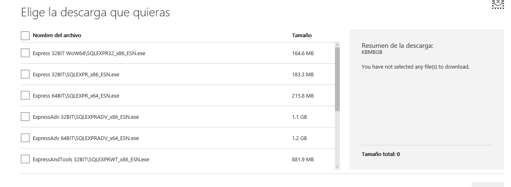

* A la hora de la instalación, elegiremos la ruta en la que lo queremos.

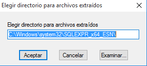

* Y procedemos con la instalación.

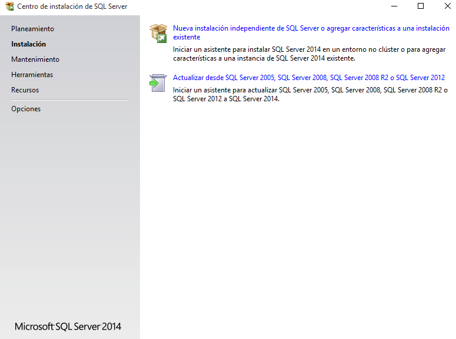

* Usaremos siguiente > siguiente en la mayoría de opciones.

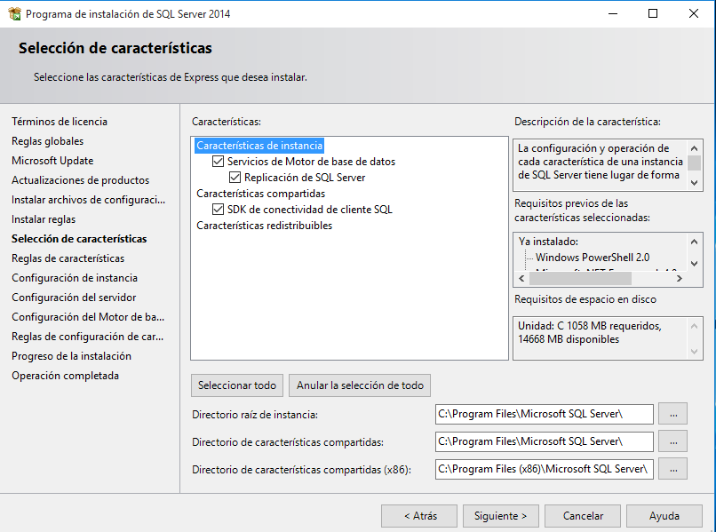

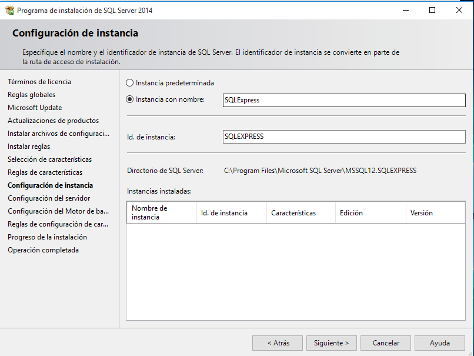

* En esta, activaremos el `SQL Browser` para permitir la búsqueda del cliente/servidor.

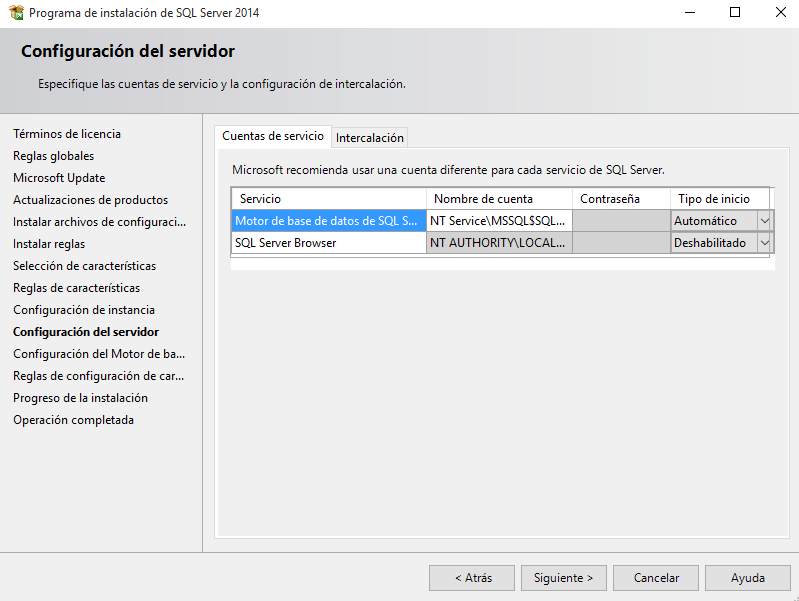

* El modo de autenticación lo pondremos a **Mixto**, para permitir autenticar vía SQL y Windows.

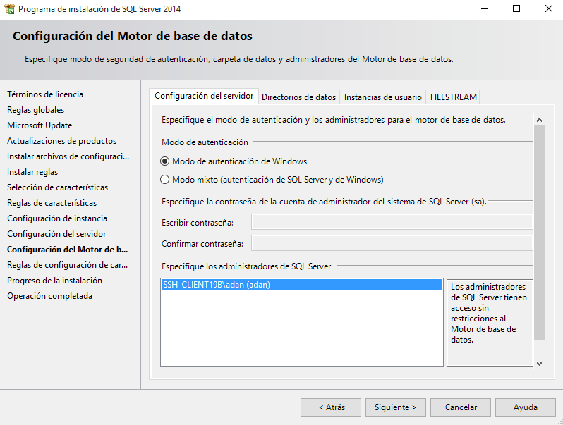

* Y terminamos la instalación.

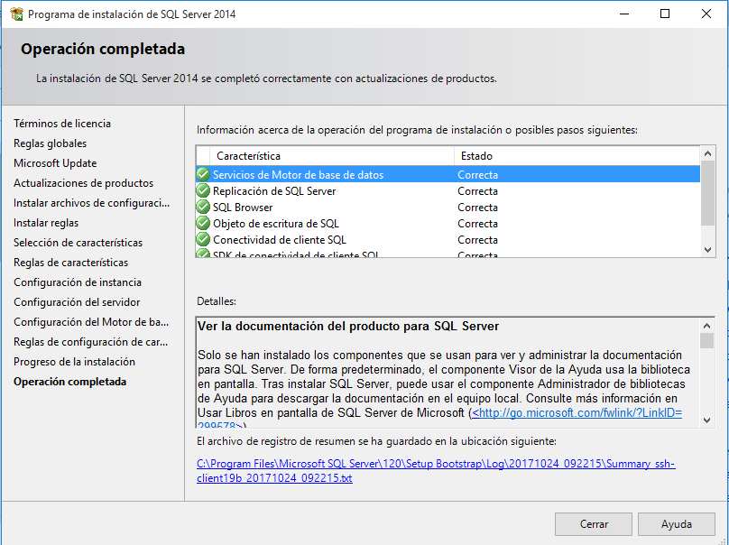

* Lo siguiente es descargar/instalar el `SQL Server Management Studio`, que iremos también a la página oficial.

* Una vez descargado, procedemos a instalarlo.

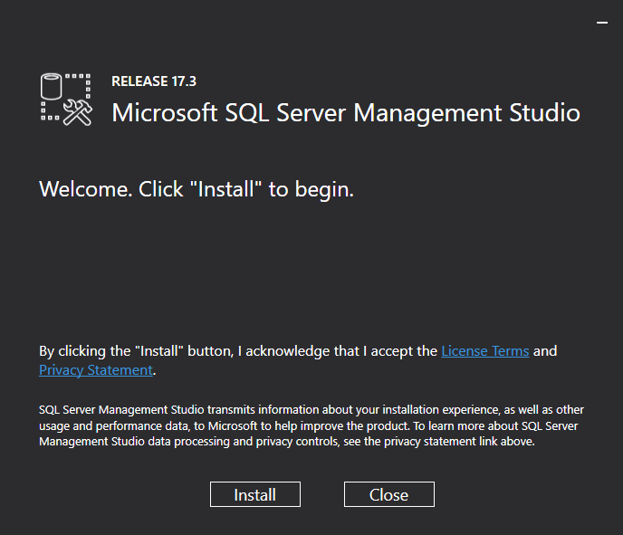

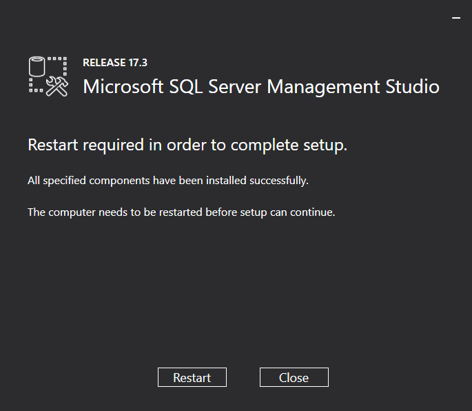

* Y lo iniciamos.

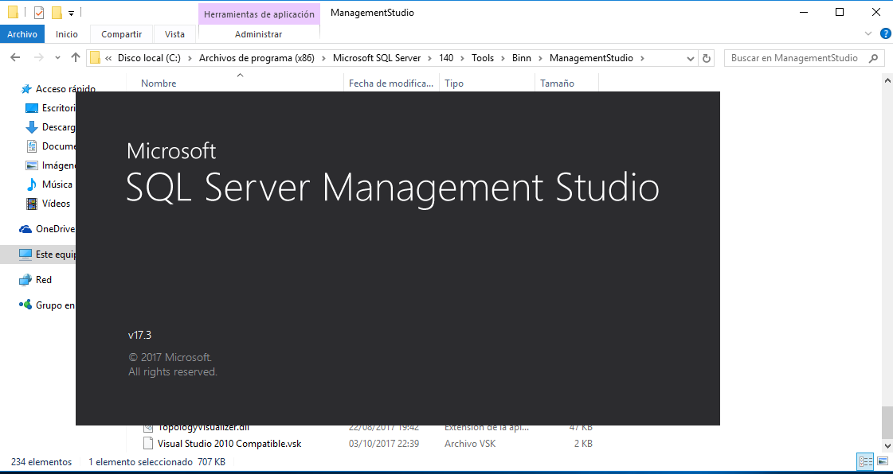

* Autenticamos como usuario Windows primero.

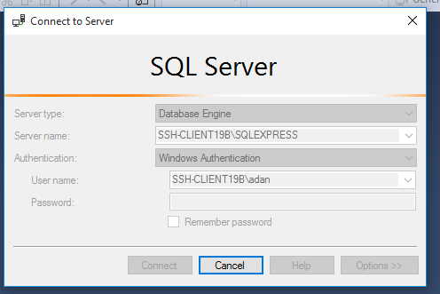

* Configuramos el usuario SQL `sa` cuya *password* es **Administrador1**.

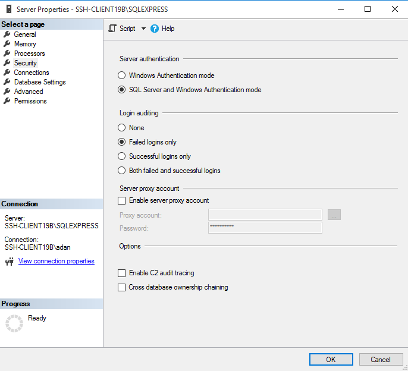

* E iniciamos sesión mediante autenticación SQL y con el usuario **sa**.

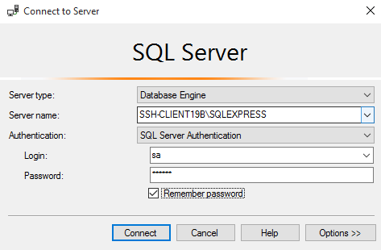

* Y ya estamos dentro, con conexión local.

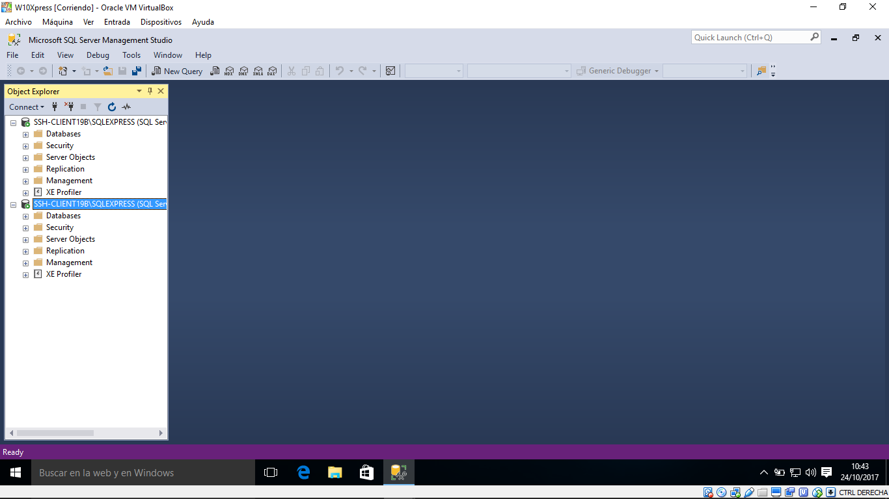

---

# Cliente

* Descargamos solamente el `MySQL management studio`

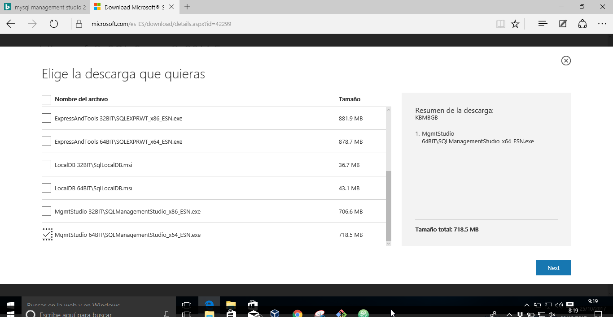

* Y realizamos la instalación tal y como la hicimos anteriormente en la otra máquina.

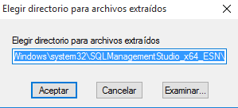

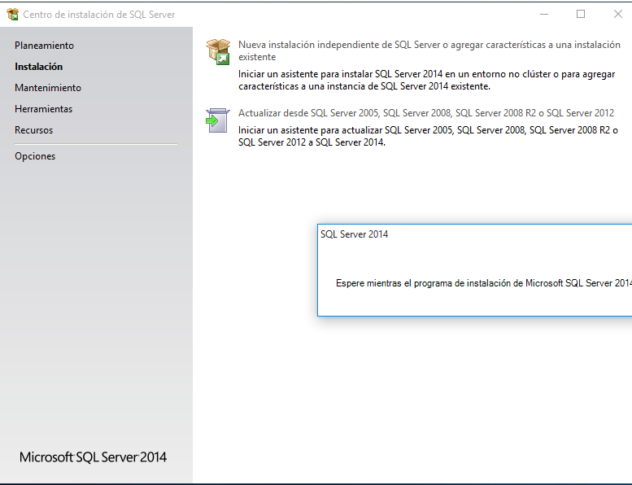

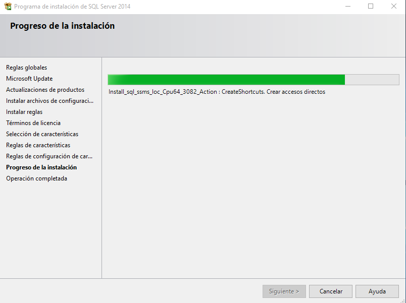

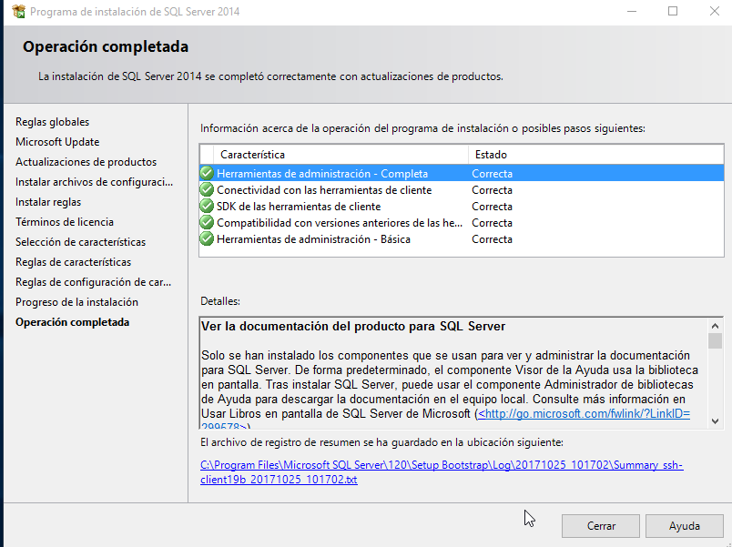

* Intentamos autenticar vía SQL Server con el usuario **sa** y su contraseña, y poniendo la *IP de nuestro servidor*.

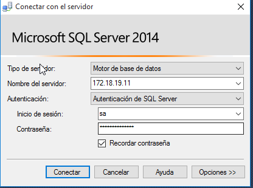

* Pero me aparece un error que no se solucionar, ya que en la configuración del servidor, en su protocolo TCP/IP he asignado un puerto para que entre directamente y aún así no entra, y tengo los servicios activos.

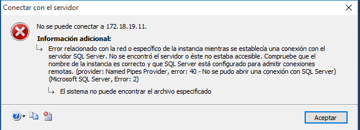
