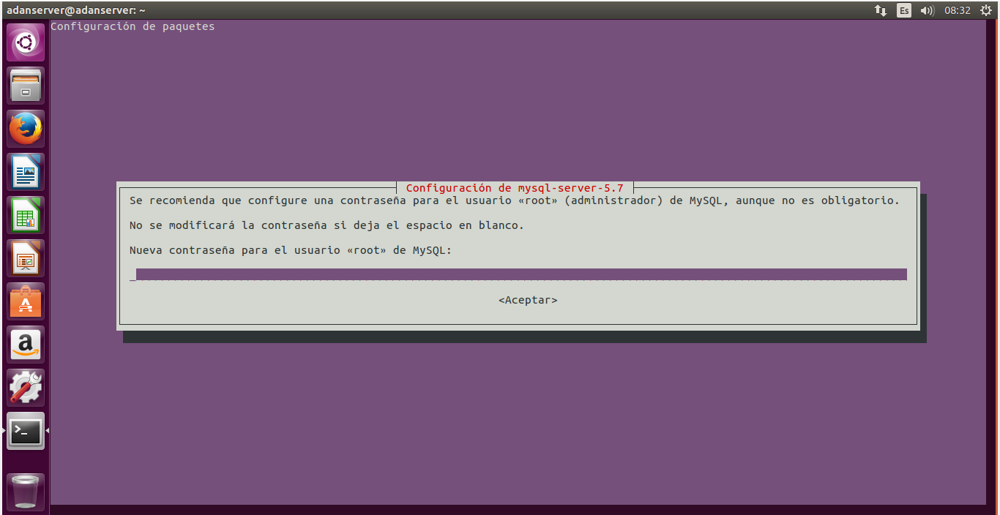
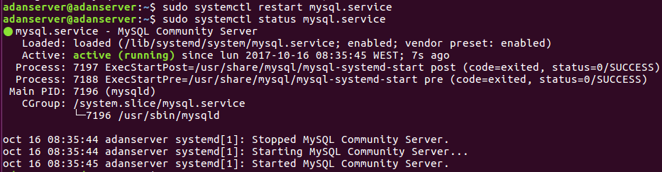
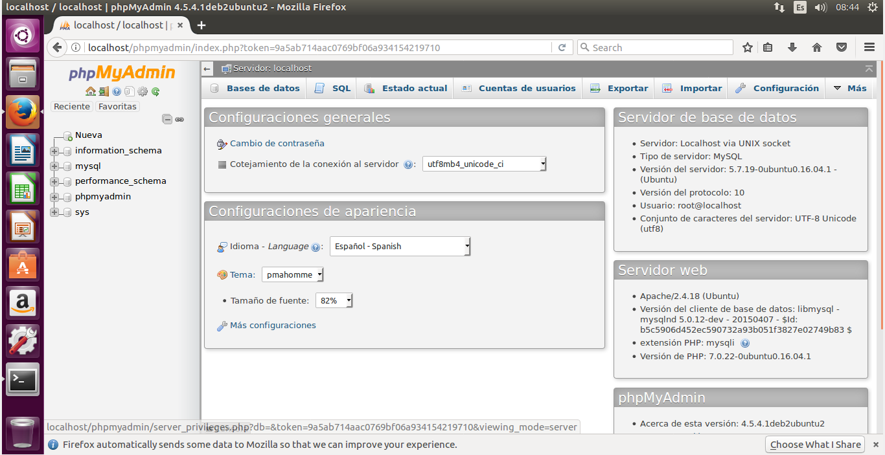
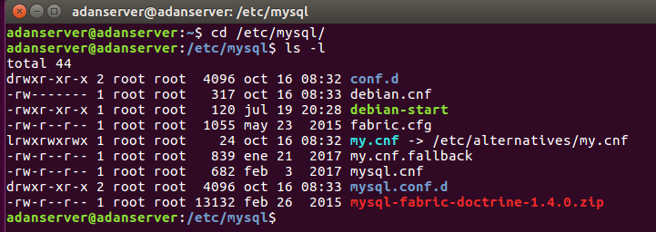
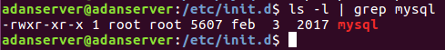
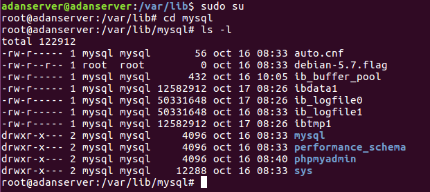
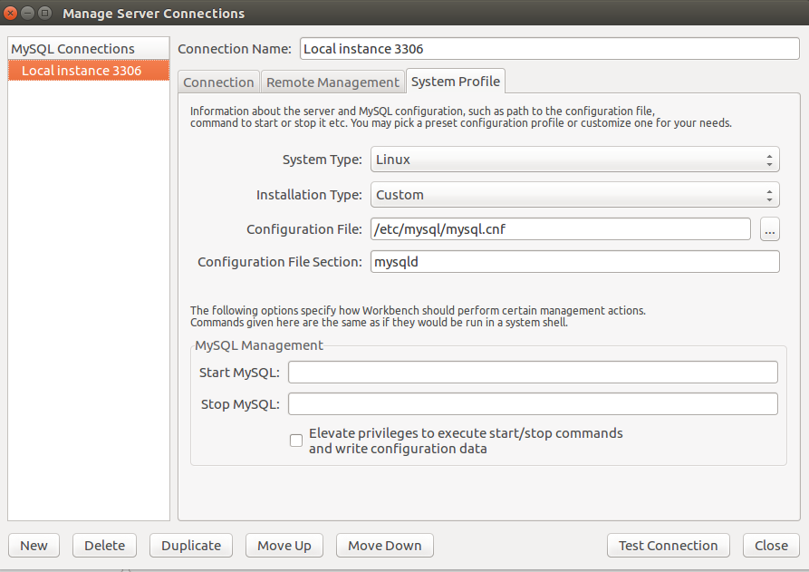
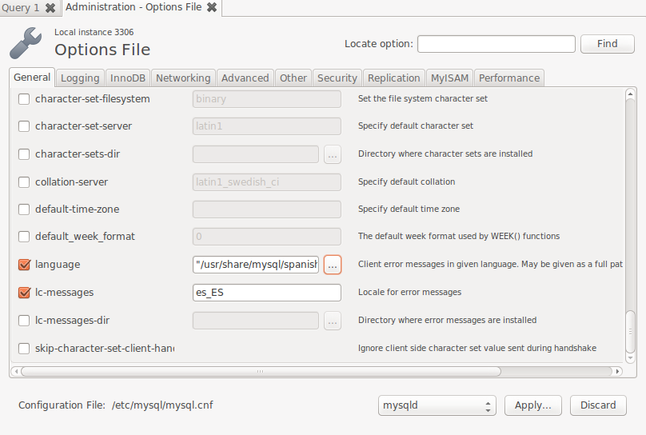

# Instalación de MySQL Community en Linux.

# Máquina servidor.

* Abrimos una terminal, y en ella, con el comano `sudo apt-get install mysql-server` instalamos el servidor *MySQL*.
  * Al ejecutar el comando, procederemos con la instalación y nos pedirá una contraseña para el usuario *root*.

* Luego hacemos lo mismo, pero esta vez instalando el cliente.

* Reiniciamos el servicio `mysql` y comprobamos que está *activo*.

* Lo siguiente será el *Workbench*, para poder trabajar.

* Y el **phpMyAdmin** para poder hacer conexiones.

* Entramos en un navegador, y hacemos la comprobación de que todo ha ido correctamente. Simplemente ponemos en la ruta `localhost/phpMyAdmin`.

* Finalizamos la instalación de MySQL con la instalación segura, para no tener problemas.

# Indicaciones

* Directorio de instalación base.

* Directorio servicio/proceso demonio y fichero de configuración del servidor y ubicación.

* Directorio de datos.

* Archivo de configuración de Workbench.

* Lenguaje de los mensajes de error.

* Usuario propietario: **MySQL**.

