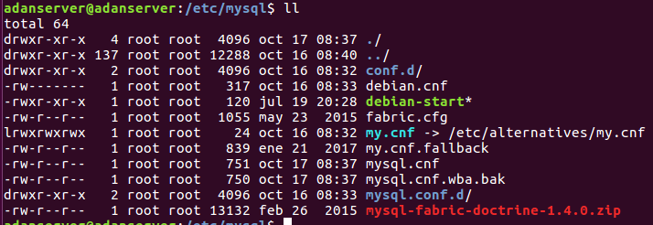
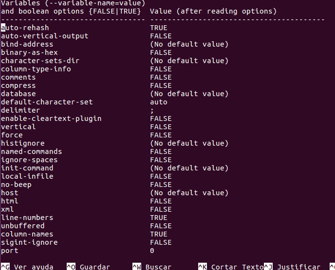

# Fichero de Opciones y variables de servidor.

---

## 1 Fichero de opciones

* Haz la lectura de la siguiente página "Using Option Files" http://dev.mysql.com/doc/refman/5.7/en/option-files.html


* Encuentra el fichero my.ini o my.cnf de tu instalación de MySQL (podría no estar en una ubicación no estándar).



* ¿Cómo se escribe un comentario en este fichero?¿Y un grupo de opciones?¿Todas las opciones tienen un valor?
  * `sudo nano /etc/alternatives/my.cnf` y dentro de ese archivo, con el símbolo `#`.


* Ejecuta "mysqld --verbose --help" desde una consola para ver una lista de las variables del servidor. Para ver mejor el texto mejor redirecciona la salida a fichero.





* Explica qué significan y que se consigue con cada una de las variables del siguiente fichero de configuración

 ```cmd
[client]                  #Cliente
port=3306                 #Utiliza el puerto 3306
password="telesforo";     #Utiliza la contraseña telesforo

[mysqld]                  #Dentro de mysql
port=3306                 #Utiliza el puerto 3306
key_buffer_size=16M       #Tamaño del buffer
max_allowed_packet=8M     #Máximo tamaño permitido de paquetes

[mysqldump]
quick                     #Copia de datos
```

---

## Variables del servidor.

* Define qué son las variables del servidor.
  * El servidor MySQL tiene muchas variables de sistema que indican cómo está configurado. Cada variable del sistema tiene un valor predeterminado. Las variables del sistema se pueden configurar al inicio del servidor usando opciones en la línea de comando o en un archivo de opciones.


* Usa el comando "SHOW VARIABLES" para conocer el valor de todas las variables y enviar el resultado a un fichero.
  * 

* Repite lo anterior para mostrar solo las variables relacionadas con el motor "InnoDB".
  * 

* Para gestionar variables tenemos, como hemos visto, el comando SHOW "comando":
  * cómo mostrar todos los motores de almacenamiento
    * show engines
  * cómo mostrar el estado actual del servidor
    * show status
  * cómo averiguar todos los clientes que están conectados al servidor
    * show processlist
  * cómo conocer todas las tablas que están abiertas
    * show open tables

## Variables de estado.

* Define qué son las variables de estado.
  * Varias variables de estado proporcionan recuentos de declaraciones. Para determinar el número de sentencias ejecutadas, use estas relaciones. El servidor MySQL mantiene muchas variables de estado que proporcionan información sobre su funcionamiento.

* Usa el comando "SHOW STATUS" para conocer el valor de todas las variables..
  * 

* Haz que uno o más de tus compañeros se conecte a tu servidor (puede que por cuestión de permisos no os podáis conectar).
  * 

* Comprueba quién está conectado usando el comando correspondiente (Pista: es un comando visto SHOW XYZ).
  * 

* Intenta desconectarlo con el comando "kill"
  * 

* ¿Cuántas consultas se están ejecutado hasta el momento en tu servidor MYSQL? ¿Y si se trata de consultas lentas?
  * 

* Un estado informa  el sobre el máximo de conexiones concurrentes que se ha dado en la sesión de trabajo. ¿Cuál es?
  * 
