# Instalación de MySQL Community en Windows.

# Máquina servidor.

* hola

* Vamos al enlace de descarga de la página oficial.

* Descargamos el **.msi** que nos corresponda.

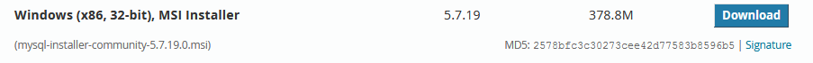

* Y procedemos la instalación como `developer`.

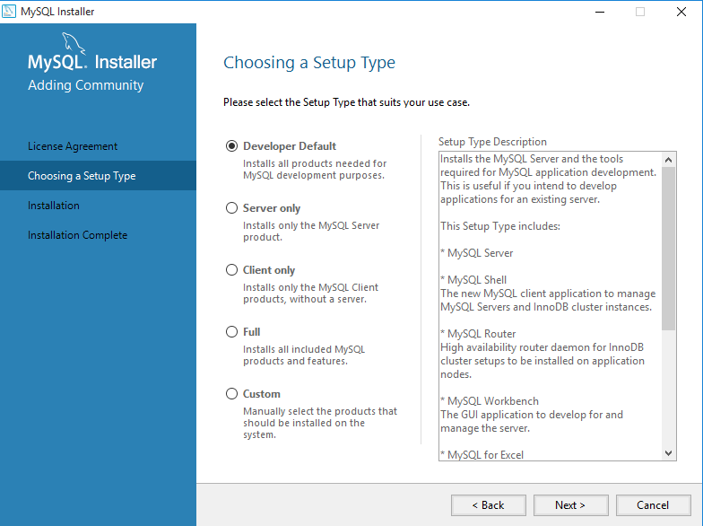

* Seleccionaremos todos los detalles, menos *Excel, Visual Studio y Python*.

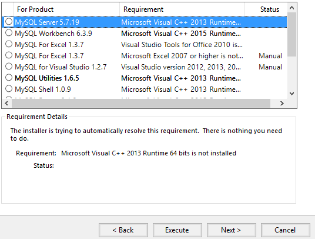

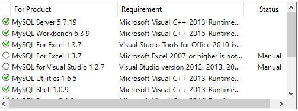

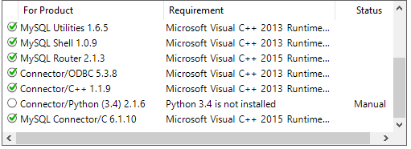

* Elegimos la opción `Standalone MySQL Server`.

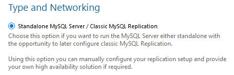

* Asignamos esta máquina como la máquina de **desarrollo**.

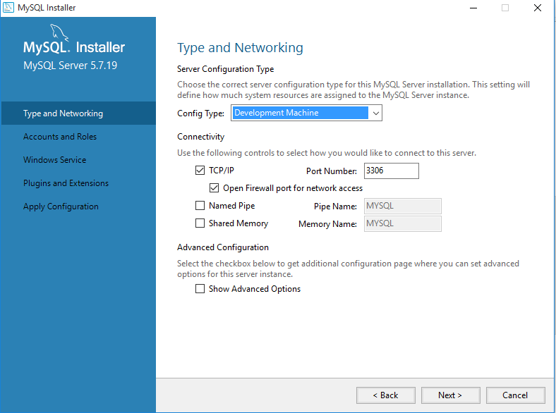

* Y registramos una contraseña para el usuario **root**.

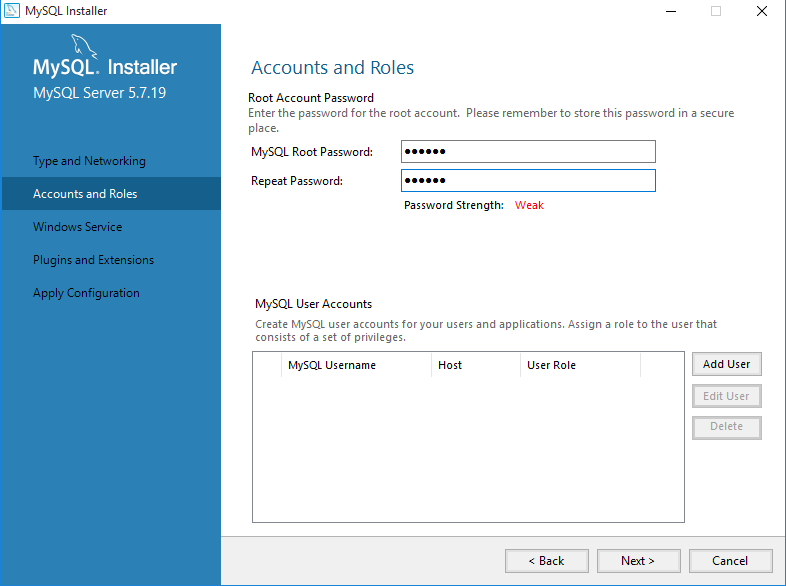

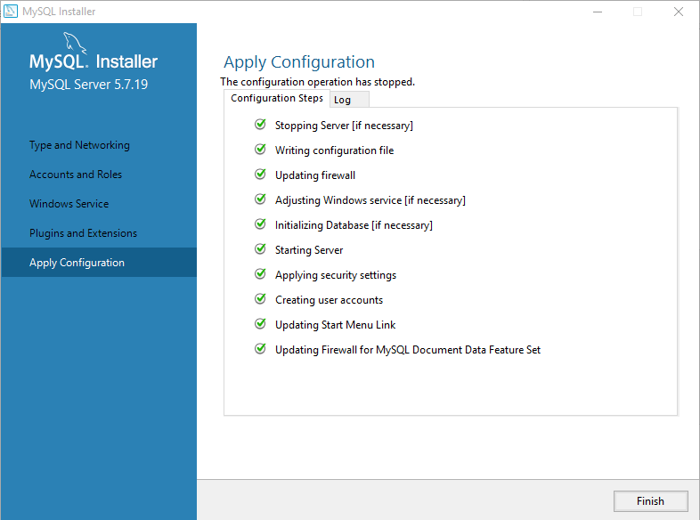

* Y ya está terminada la instalación del MySQL en el servidor.

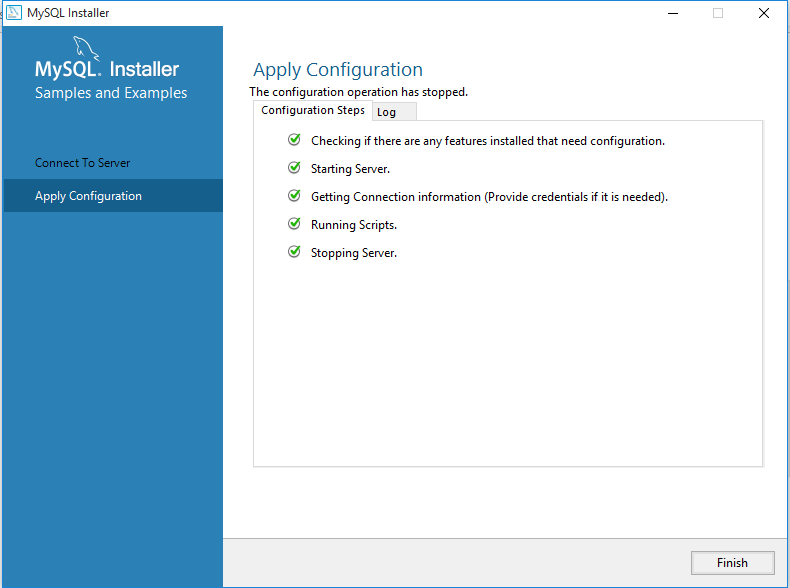

* Iniciamos la `cmd` de *MySQL* para comprobar que todo ha ido bien.

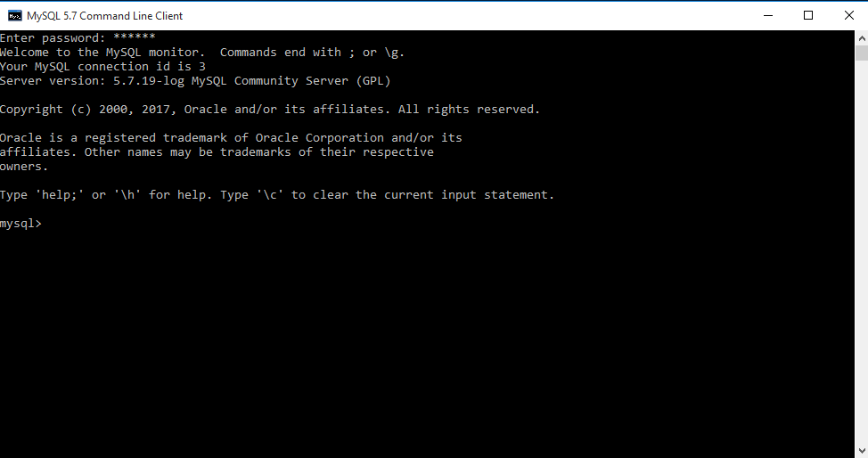

* Y luego iniciamos el Workbench, donde comprobaremos que también las `BD` predeterminadas se han creado correctamente.

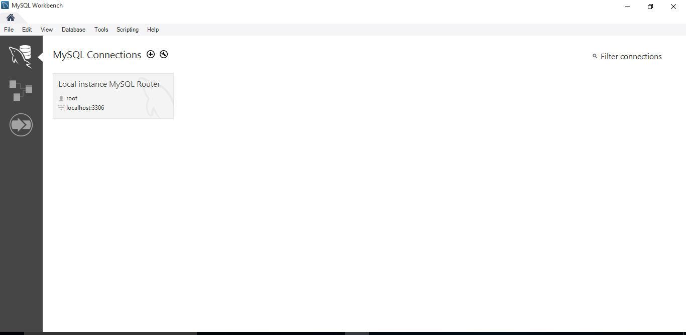

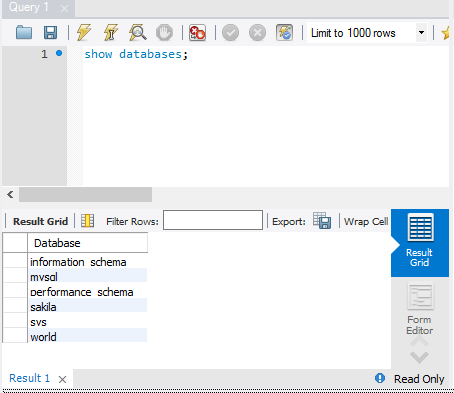

* Vamos a `Options File` y tenemos que activar la opción de **Bind-Address** para poder tener conexión desde el cliente.

# Cliente

* Ahora en la máquina cliente, procederemos a instalar el Workbench, y probar la conexión hacia la máquina de desarrollo.

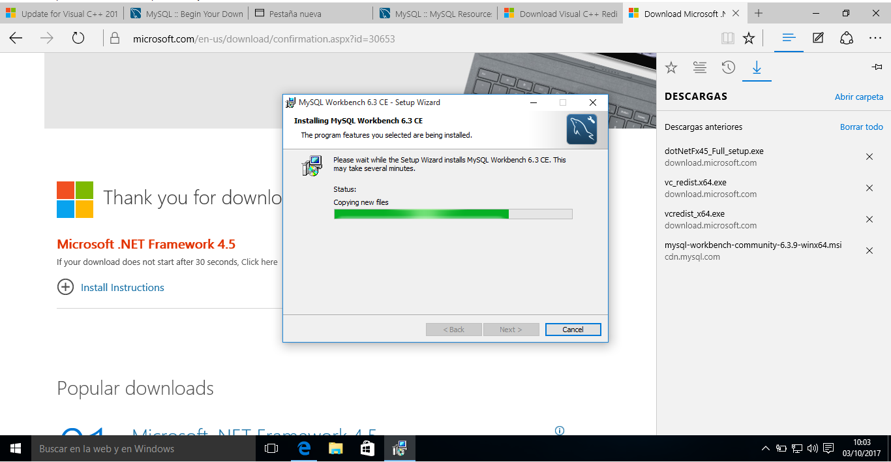

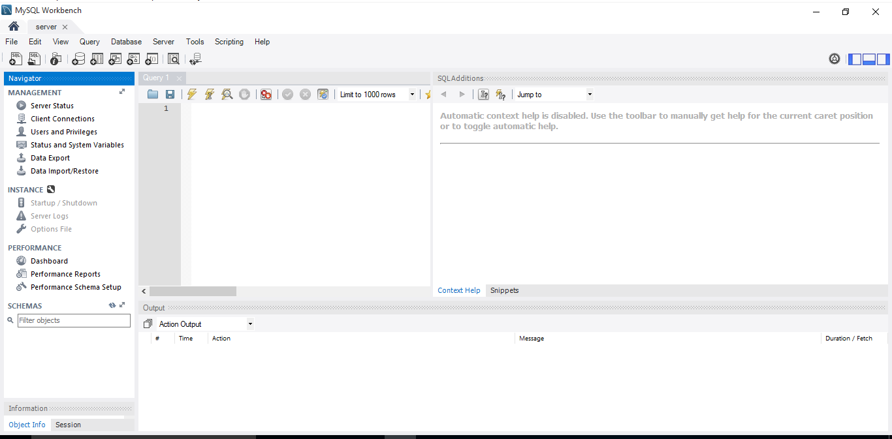

* Y una vez ya instalado, vamos a descargar el **Xampp** para crear una conexión virtual con el host.

> Lo descargamos de la página oficial de XAMPP.

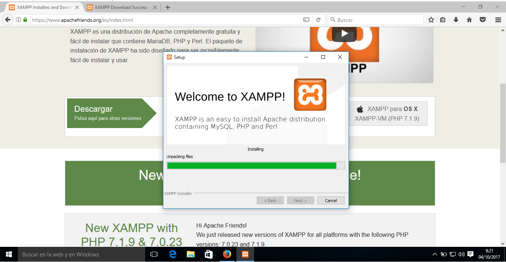

* En el archivo de configuración de MySQL tenemos que hacer algunos retoques. La ruta es `C>ProgramData>MySQL>MySQL Server 5.7`

> El archivo está oculto.

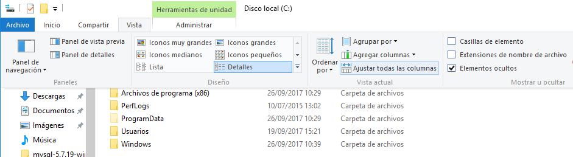

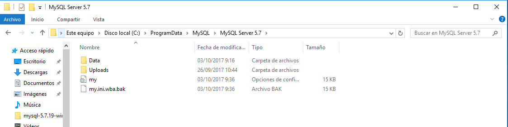

* En `['Servers'][$i]['password']` tenemos que poner nuestra password de *root*.

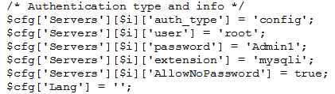

* Y configurar el usuario `pma`.

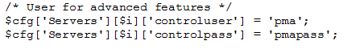

* Con esto ya podemos hacer conexión remota **Cliente/Servidor** a través de *phpMyAdmin*.

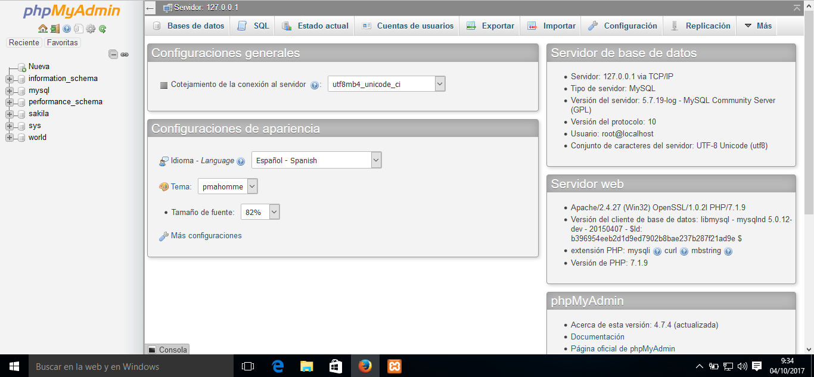

* Creamos una nueva *base de datos* con datos de `phpMyAdmin`

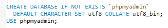

* Y terminamos creando el usuario `pma` que configuramos antes en el archivo de configuración de MySQL.

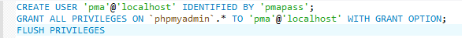

