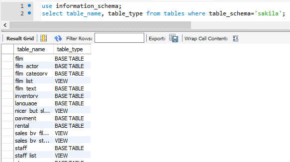
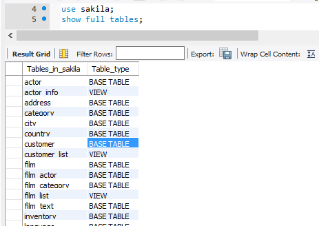
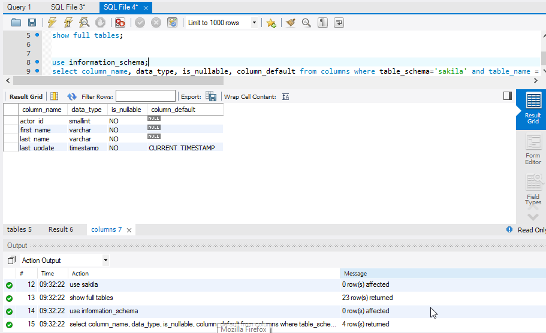
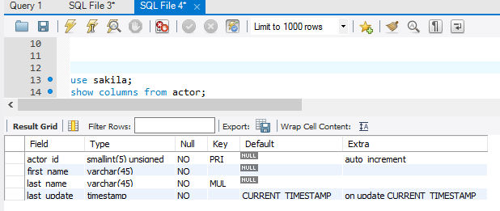

# Diccionario de datos.

* Interrogando la bases de datos Information_schema, extrae información (atributos table_name, table_type) sobre las tablas que conforman la base de datos "sakila".

*  ¿Cuál es el comando SHOW equivalente al anterior?

*  Repite lo mismo extrayendo la información sobre el esquema de una tabla en particular de la base de datos "sakila" (atributos column_name, data_type, is_nullable, column_default). Usar tabla columns

*  ¿Cuál es el comando SHOW equivalente al anterior?

*    Atendiendo a la base de datos "Information_schema", ¿cuáles son las tablas principales según tu criterio? Puedes ayudarte para ver todas las tablas utilizando Workbench. Para ello ir a preferencias y activar ver los metadatos.
      * `engines, columns, tables`.
