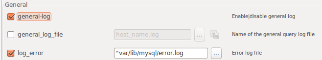
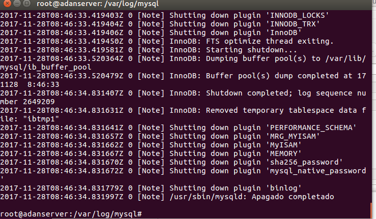
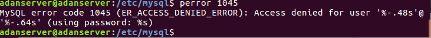
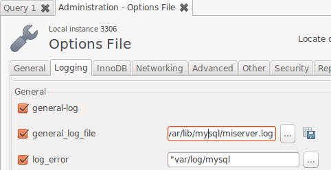
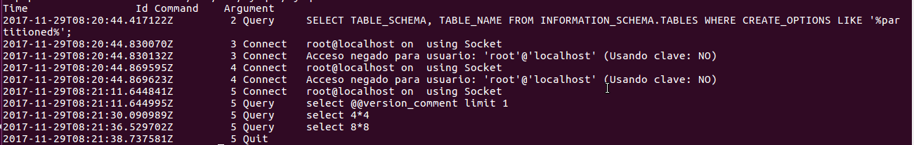

# Ficheros LOG: Error LOG.

* Explica qué es y para qué sirve el "ERROR LOG"
  * *Registra los diferentes errores que ocurren en el server MySQL, viene activo por defecto.*

* Indica al servidor en "my.cnf" que registre los errores en un fichero llamado "server_error". Reinicia el servidor y comprueba los mensajes  visualizando dicho fichero
  * *En dicho archivo tenemos que añadir la siguiente línea:*
    * *`log_error = /var/lib/mysql/error.log`*

    * 

* Detén el servidor abruptamente (haz lo que sea necesario) y comprueba cómo se ha modificado dicho fichero.
  * *Buscamos el proceso MySQL con el comando `ps -aux | grep mysql`, y una vez tengamos su PID, utilizamos el comando `kill`.*
    * 

* Prueba la función "perror" incluida en el directorio bin. ¿Cuál es su objeto? Puedes consultar http://dev.mysql.com/doc/refman/5.7/en/perror.html
  * *Perror muestra la información de los códigos de error del servidor MySQL.*
  * 

---

# Ficheros LOG: General Query LOG

* Explica qué es y para qué sirve el "GENERAL QUERY LOG"
  * *Es el encargado de registrar las acciones de mysql. Controla acciones y descubre los errores que van cometiendo los clientes.*

* Configura MySQL para registrar consultas generales en el fichero denominado "miserver.log". Comprueba su funcionamiento haciendo que un compañero se conecte a tu servidor y ejecute varias consultas.
  * 

* Averigua viendo el fichero "miserver.log" la hora en que se conectó tu compañero y ejecutó las consultas del apartado anterior.
  * 

* Accede al servidor a través de Workbench. ¿Qué se registra en "general_log"?¿Hay alguna diferencia respecto al cliente mysql?
  * *Es casi idéntico, excepto que los usuarios aparecen con una doble conexión, y los logs vienen más detallados.*
